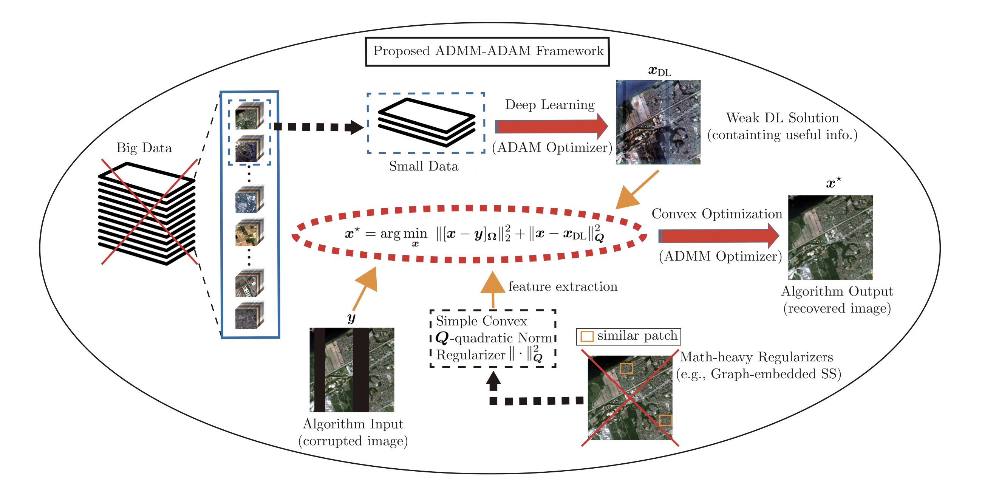

## Content
-[Introduction](#introduction)
-[ADMM-ADAM framework](#adnn-adam-framework)
-[Run the code](#run-the-code)
-[Reference](#reference)
## Introduction
ADMM and ADAM are two optimizers of paramount importance in convex optimization and deep learning. ADMM-ADAM can solve the problem of hyperspectral image inpainting. The framework was designed by Dr. Chia-Hsiang Lin in 2021.

## ADMM-ADAM framework
Proposed ADMM-ADAM framework:


## Run the code
```shell
python3 app.py
```

## Reference
C. -H. Lin, Y. -C. Lin and P. -W. Tang, "ADMM-ADAM: A New Inverse Imaging Framework Blending the Advantages of Convex Optimization and Deep Learning," in IEEE Transactions on Geoscience and Remote Sensing, doi: 10.1109/TGRS.2021.3111007.[(Link)](https://ieeexplore.ieee.org/document/9546991)